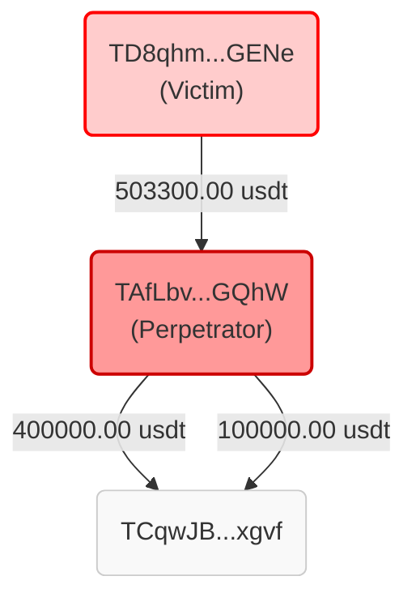

# Trace Diagram

```mermaid
flowchart TD
    %% Styling
    classDef victim fill:#ffcccc,stroke:#ff0000,stroke-width:2px
    classDef perpetrator fill:#ff9999,stroke:#cc0000,stroke-width:2px
    classDef service fill:#ccffcc,stroke:#00cc00,stroke-width:2px
    classDef unknown fill:#f9f9f9,stroke:#cccccc,stroke-width:1px
    NTD8qhm("TD8qhm...GENe<br/>(Victim)"):::victim
    NTAfLbv("TAfLbv...GQhW<br/>(Perpetrator)"):::perpetrator
    NTCqwJB("TCqwJB...xgvf"):::unknown
    NTD8qhm -- "503300.00 usdt" --> NTAfLbv
    NTAfLbv -- "400000.00 usdt" --> NTCqwJB
    NTAfLbv -- "100000.00 usdt" --> NTCqwJB
```
